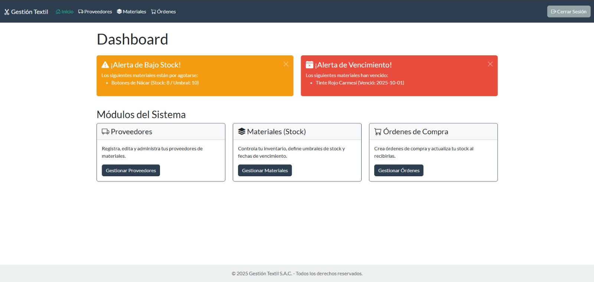

# ✂️ Gestión Textil - Sistema de Compras

Sistema de aplicación web para la gestión de compras, proveedores y stock de materiales en una empresa textil. Construido con **Spring Boot**, **Spring Security** y una base de datos en memoria **H2** para una ejecución y demostración instantáneas.

## 📸 Vista Previa del Dashboard



---

## ✨ Características Principales

* **🏠 Dashboard de Notificaciones:** La página de inicio recibe al usuario con alertas visuales para materiales con **bajo stock** y productos **vencidos**.
* **🧑‍💼 Gestión de Proveedores:** CRUD completo para registrar, editar y eliminar proveedores.
* **🧵 Gestión de Materiales (Stock):** CRUD completo para administrar el inventario, incluyendo stock actual, umbral de alerta y fecha de vencimiento.
* **🛒 Flujo de Órdenes de Compra:**
    1.  Creación de órdenes de compra asignadas a un proveedor.
    2.  Adición de múltiples materiales (detalles) a la orden.
    3.  Recepción de la orden con un clic, lo que **actualiza automáticamente** el stock de los materiales correspondientes.
* **🔒 Seguridad Integrada:** Acceso protegido por usuario y contraseña usando **Spring Security** con un formulario de login personalizado.
* **🎨 Interfaz Moderna:** Diseño responsivo (mobile-friendly) creado con **Bootstrap 5 (Tema "Flatly")**, íconos y un layout unificado con navbar y footer.
* **🚀 Cero Configuración:** Utiliza una base de datos **H2 en memoria** que se auto-carga con datos de prueba (`data.sql`). ¡No requiere instalar MySQL ni ningún motor de BD!

---

## 🛠️ Stack Tecnológico

| Categoría | Tecnología |
| :--- | :--- |
| **Backend** | ☕ Java 17, 🌱 Spring Boot |
| **Persistencia** | 🍃 Spring Data JPA (Hibernate) |
| **Base de Datos** | 🚀 H2 (En Memoria) |
| **Frontend** | 📄 Thymeleaf (Motor de plantillas) |
| **Seguridad** | 🔐 Spring Security |
| **Diseño** | 💅 Bootstrap 5 (Bootswatch "Flatly") & Bootstrap Icons |
| **Dependencias** | Lombok, Spring Web, Validation |

---

## 🚀 Cómo Ejecutar el Proyecto

Este proyecto está configurado para funcionar sin ninguna instalación de base de datos externa.

### Pre-requisitos

1.  Tener instalado **Java 17** (o superior).
2.  Tener instalado **Apache Maven**.

### Pasos

1.  Clona o descarga este repositorio en tu máquina local.
2.  Abre una terminal (CMD, PowerShell, Git Bash, etc.).
3.  Navega hasta la carpeta raíz del proyecto (donde se encuentra el archivo `pom.xml`).
4.  Ejecuta el siguiente comando de Maven para iniciar la aplicación:

    ```bash
    mvn spring-boot:run
    ```

5.  ¡Listo! Abre tu navegador y accede a `http://localhost:8080/`.

---

## 🔑 Acceso a la Aplicación

Una vez que la aplicación esté en ejecución, puedes acceder con las siguientes credenciales:

> **URL:** `http://localhost:8080/`
>
> **Usuario:** `admin`
>
> **Contraseña:** `admin123`

---

## 📊 Acceso a la Base de Datos (H2 Console)

Si deseas inspeccionar la base de datos en memoria, ver las tablas y los datos de prueba mientras la aplicación se ejecuta, puedes usar la consola H2.

1.  Abre la siguiente URL en tu navegador:
    `http://localhost:8080/h2-console`

2.  Ingresa los siguientes datos en el formulario de H2 (es **crucial** que el JDBC URL sea el correcto):

> **JDBC URL:** `jdbc:h2:mem:db_textil`
>
> **User Name:** `sa`
>
> **Password:** (déjalo en blanco)

3.  Haz clic en **Connect**.
